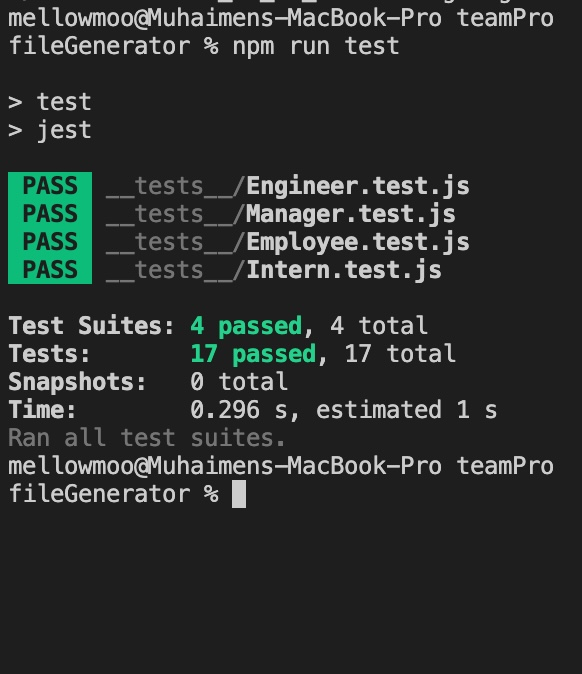

# teamProfileGenerator
A simple profile generator using inquire and express.
This app takes the information of a team and then generates a simple HTML page to view details about the team.  This app uses node.js and the npm package inquirer.

## Table of Contents

- [How To Run](#how-to-run)
- [The Demo](#the-demo)
- [About Me](#about-me)
- [Future Development](#future-development)
- [Built With](#built-with)

### How To Run
After forking the repository, you want to make sure node is installed on your device.
1. Within the terminal for the repo you want to run an npm install.
```
npm install
```
2. To run the tests, run the following command.
```
npm run test
```
3. Start the app using the node command to start the app from the index file.
```
node index.js
```
4. Once you fill in the prompts, the app should have created an HTML page in the output folder.  

### The Demo

Below is a link to a youtube video of the application in action.


Below are a few screenshots of the functionality of the app.

### Run Tests



### Start App


### Validate Info


### App Output


### About Me
This app was created by Muhaimen Ahmed. You can find me at github.com/mellowmoo .  Thank you for checking it out.

Special thanks for those who helped me when I got stuck on certain parts of development.

### Future Development
This app works as intended, and as a proof of concept, no further development is needed.  However if someone would like to tell me if there are any shortcomings in my code or places where my practices could be improved, please let me know.

### Built With

* [HTML](https://developer.mozilla.org/en-US/docs/Web/HTML)

* [CSS](https://developer.mozilla.org/en-US/docs/Web/CSS)

* [Javascript](https://developer.mozilla.org/en-US/docs/Web/JavaScript)

* [jQuery](https://developer.mozilla.org/en-US/docs/Glossary/jQuery)

* [Node.js / Express](https://developer.mozilla.org/en-US/docs/Learn/Server-side/Express_Nodejs)

* [Bootstrap](https://getbootstrap.com/docs/4.4/getting-started/introduction/)

* [Inquirer](https://www.npmjs.com/package/inquirer)